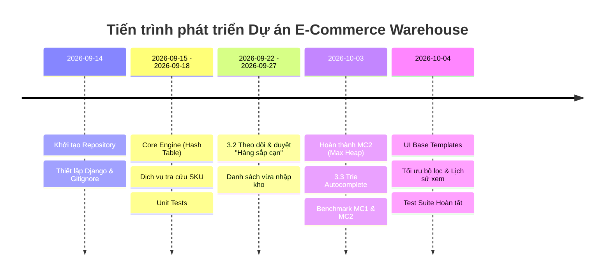

# NHẬT KÝ QUÁ TRÌNH THỰC HIỆN DỰ ÁN (PROJECT DEVELOPMENT LOG)
**Hệ thống Quản lý Kho Hàng & Thương mại Điện tử (E-Commerce Warehouse Management System)**  
*Môn học: Cấu trúc Dữ liệu & Giải thuật (DSA)*

---

## 📌 1. TỔNG QUAN DỰ ÁN

- **Tên dự án:** E-Commerce Warehouse Management System
- **Công nghệ cốt lõi:** Python 3.14, Django Framework, SQLite, HTML5/CSS3/JavaScript.
- **Mục tiêu kỹ thuật & Cấu trúc Dữ liệu - Giải thuật (DSA):**
  - **MC1 - Tra cứu sản phẩm theo SKU:** Tự cài đặt và tối ưu cấu trúc **Bảng băm (Hash Table)** so sánh với tìm kiếm tuyến tính (Linear Search) đạt $O(1)$.
  - **MC2 - Hàng đợi ưu tiên xử lý đơn hàng (Order Queue):** Tự cài đặt **Đống cực đại (Max Heap / Priority Queue)** để phân bổ và xử lý đơn hàng theo mức độ ưu tiên trong $O(\log N)$.
  - **Tự động gợi ý từ khóa (Trie Autocomplete):** Xây dựng **Cây tiền tố (Trie / Prefix Tree)** giúp tìm kiếm và gợi ý tên sản phẩm tức thì theo tiền tố nhập liệu với độ phức tạp $O(L)$ ($L$ là độ dài chuỗi ký tự prefix).
  - **Cảnh báo tồn kho an toàn (Low Stock Warning):** Áp dụng thuật toán **Đệ quy (Recursion)** để quét, phát hiện và hiển thị danh sách các sản phẩm có số lượng tồn kho chạm hoặc dưới ngưỡng cảnh báo tối thiểu.
  - **3.1. Danh sách sản phẩm xem gần đây (Recently Viewed):** Cài đặt **Danh sách liên kết (Linked List)** quản lý các sản phẩm vừa xem với cơ chế đẩy phần tử cũ nhất ra khỏi danh sách khi vượt ngưỡng (`capacity = 9`).
  - **Đo lường hiệu năng (Benchmarking):** Đo thời gian thực thi thuật toán trên tập dữ liệu quy mô $1.000$, $10.000$, $100.000$ bản ghi và xuất báo cáo Excel (`benchmark_results.xlsx`).

---

## 👥 2. DANH SÁCH THÀNH VIÊN VÀ PHÂN CÔNG ĐÓNG GÓP

| Thành viên (Git Author) | Vai trò / Nhiệm vụ chính |
| :--- | :--- |
| **Đại Nghĩa (Dai Nghia)** | Người xây dựng cấu trúc dự án & Models/Templates ban đầu; phát triển **Module MC2 (Max Heap)**, **3.1. Danh sách sản phẩm xem gần đây (Linked List)**; phối hợp Benchmark & Review/Merge PRs. |
| **LocNMP** | Thiết kế cấu trúc dữ liệu thuần Hash Table (`engine/datastructures`), Dịch vụ tra cứu SKU, Cơ chế đồng bộ Cache-DB, Tối ưu bộ lọc. |
| **hunglevannn** | Thực hiện 2 chức năng chính: **3.2. Theo dõi và duyệt danh sách "Hàng sắp cạn"** và **Danh sách vừa nhập kho**. |
| **Nguyen Van Khanh** | Phát triển **3.3. Tính năng Gợi ý tự động (Autocomplete)** sử dụng Cây tiền tố (**Trie / Prefix Tree**). |

---

## 📅 3. NHẬT KÝ TIẾN TRÌNH CHI TIẾT THEO MỐC THỜI GIAN

---

### 🔹 Giai đoạn 1: Khởi tạo Kiến trúc & Thiết lập Nền tảng (14/09/2026 - 15/09/2026)

- **14/09/2026:**
  - `767347a` - Khởi tạo repository ban đầu (`first commit`).
  - `8afb033`, `f116e95` - Cập nhật và bổ sung tài liệu hướng dẫn thiết lập hệ thống (`README.md`).
  - `2f1ac69`, `4adeda9` - Chuẩn hóa `.gitignore` cho môi trường Python virtualenv và SQLite.
- **15/09/2026:**
  - `fe041f4` - Xây dựng các Model dữ liệu Django cho hệ thống sản phẩm, hoàn thiện giao diện demo danh sách sản phẩm.
  - `f360b67` - Xây dựng module cấu trúc dữ liệu thuần `engine/datastructures/` (khởi tạo `HashTable`) và viết bộ unit test `testHashTable.py`.

---

### 🔹 Giai đoạn 2: Tối ưu Bảng băm & Triển khai MC1 Tra cứu SKU (16/09/2026 - 18/09/2026)

- **16/09/2026:**
  - `fadbced` - Sửa đổi, hoàn thiện các ca kiểm thử cho Hash Table.
  - `183c054` - Tạo lớp dịch vụ `products/services.py` kết nối trực tiếp cấu trúc Hash Table với tầng truy vấn của Django.
  - `77b46e4` - Cập nhật chức năng tìm kiếm sản phẩm theo mã SKU sử dụng Bảng băm tùy chỉnh.
  - `eb7b06d` - Tối ưu hóa hàm băm và giải thuật xử lý va chạm trên Hash Table.
  - `0d42dc3` - Dọn dẹp các tệp tin hệ thống thừa (`.DS_Store`) và chuẩn hóa cấu hình Git.
- **18/09/2026:**
  - `079584f` - Tiến hành kiểm thử tải và tính đúng đắn trên luồng tra cứu SKU.

---

### 🔹 Giai đoạn 3: Thực Hiện Chức Năng 3.2 "Hàng Sắp Cạn" & Danh Sách Vừa Nhập Kho (22/09/2026 - 27/09/2026)

- **22/09/2026:**
  - `004d710` - Xây dựng nền tảng chức năng **3.2: Theo dõi và duyệt danh sách "Hàng sắp cạn"** cùng luồng ghi nhận dữ liệu **Danh sách vừa nhập kho**.
- **27/09/2026:**
  - `e481e80` - Hoàn thiện giao diện, bảng duyệt sản phẩm "Hàng sắp cạn" và chức năng quản lý danh sách sản phẩm vừa nhập vào kho.

---

### 🔹 Giai đoạn 4: Hoàn thiện MC2 (Max Heap), Tích hợp Benchmark & Đo đạc Thực nghiệm (03/10/2026)

- **Sáng - Chiều 03/10/2026:**
  - `47b5909` - Hoàn thành phát triển tính năng **3.3: Gợi ý tự động (Autocomplete)** ứng dụng cấu trúc Cây tiền tố (**Trie / Prefix Tree**) tìm kiếm tức thì theo tiền tố tên sản phẩm.
  - `3bcaa0e`, `5845c52` - Đồng bộ nhánh `hung` và merge Pull Request #1.
  - `53e83c7` - Dọn dẹp cache `__pycache__` tránh xung đột.
  - `b55e4f8`, `d9f4833` - Đồng bộ và merge Pull Request #2 (`feature/loc/product-lookup`).
  - `9491e90` - Chuẩn hóa hiển thị danh sách sản phẩm sắp hết hàng (`low_stock_list.html`).
- **Tối 03/10/2026:**
  - `8d479f9` - **Triển khai MC2**: Xây dựng hàng đợi đơn hàng ưu tiên `order_queue` sử dụng cấu trúc Đống cực đại (**Max Heap**).
  - `462c8a0` - Viết kịch bản kiểm thử hiệu năng thuật toán tra cứu mã SKU.
  - `4582eb0` - Xử lý cơ chế đồng bộ tự động giữa Database và Bảng băm trong bộ nhớ (Keep SKU Hash Table synced with product changes).
  - `d6d4f3c` - Ghi nhận số liệu đo đạc benchmark thực tế vào tài liệu kỹ thuật.
  - `4470454` - Xây dựng Django Management Command `benchmark_mc1_mc2` tự động hóa việc đo thời gian thực thi ở các quy mô $1.000$, $10.000$, $100.000$ và xuất trực tiếp ra `benchmark_results.xlsx`.
  - `916de2b` - Merge Pull Request #3 (`feature/loc/sku-sync`).

---

### 🔹 Giai đoạn 5: Tối ưu UI/UX, Lịch sử Xem Gần Đây (Linked List) & Hoàn tất Bộ Kiểm thử (04/10/2026)

- **11:00 - 12:00 (04/10/2026):**
  - `771a0e8` - Xây dựng layout tổng thể `base.html`, nâng cấp giao diện toàn bộ các trang thành hệ thống nhất quán, hiện đại.
  - `13fff7b` - Khắc phục định dạng hiển thị thời gian tạo/xử lý trong bảng hàng đợi đơn hàng (`order_queue`).
  - `e7ff924` - Xây dựng cơ chế theo dõi lịch sử sản phẩm vừa xem (Recently Viewed) ứng dụng Danh sách liên kết (**Linked List**).
  - `05b94c6` - Khống chế dung lượng tối đa cho danh sách đã xem (`capacity = 9`) tuân theo cơ chế đẩy phần tử cũ nhất ra khỏi danh sách.
- **14:00 - 21:35 (04/10/2026):**
  - `0c97ffe` - Nâng cấp bộ lọc tìm kiếm linh hoạt theo danh mục, trạng thái và từ khóa.
  - `298083a` - Merge Pull Request #4 vào nhánh chính.
  - `be23836` - Bổ sung toàn diện bộ test case cho cấu trúc dữ liệu Max Heap (`tests/test_max_heap.py`).
  - `e53a787` - Đồng bộ phiên bản mới nhất từ remote repository lên nhánh `main`.

---

## 📊 4. BẢNG THỐNG KÊ LỊCH SỬ COMMITS (GIT LOG AUDIT)

| Mã Commit | Tác giả | Thời gian | Nội dung Commit (Message) |
| :---: | :--- | :---: | :--- |
| `767347a` | Dai Nghia | 2026-09-14 00:37 | first commit |
| `8afb033` | Dai Nghia | 2026-09-14 00:41 | Update readme |
| `f116e95` | Dai Nghia | 2026-09-14 00:42 | Update readme |
| `2f1ac69` | Dai Nghia | 2026-09-14 00:47 | Update gitignore |
| `4adeda9` | Dai Nghia | 2026-09-14 00:50 | Update gitignore |
| `fe041f4` | Dai Nghia | 2026-09-15 20:15 | Update model + demo product list |
| `f360b67` | LocNMP | 2026-09-15 23:38 | Add engine and tests + test HashTable |
| `fadbced` | LocNMP | 2026-09-16 06:00 | sua test |
| `183c054` | LocNMP | 2026-09-16 21:24 | add poducts/services.py + test |
| `77b46e4` | LocNMP | 2026-09-16 23:26 | Cap nhat tim kiem sku bang hash table |
| `eb7b06d` | LocNMP | 2026-09-16 23:52 | toi ưu hash table |
| `0d42dc3` | LocNMP | 2026-09-16 23:55 | chore: remove .DS_Store from repository and update gitignore |
| `079584f` | LocNMP | 2026-09-18 12:55 | test |
| `004d710` | hunglevannn | 2026-09-22 19:19 | Add files via upload |
| `e481e80` | hunglevannn | 2026-09-27 23:41 | Add files via upload |
| `47b5909` | Nguyen Van Khanh | 2026-10-03 13:21 | xong 3.3 |
| `3bcaa0e` | Đại Nghĩa | 2026-10-03 14:58 | Merge branch 'main' into hung |
| `5845c52` | Đại Nghĩa | 2026-10-03 15:04 | Merge pull request #1 from nigrumdiaster/hung |
| `53e83c7` | Dai Nghia | 2026-10-03 15:17 | Delete pycache |
| `b55e4f8` | Đại Nghĩa | 2026-10-03 15:32 | Merge branch 'main' into feature/loc/product-lookup |
| `d9f4833` | Đại Nghĩa | 2026-10-03 15:37 | Merge pull request #2 from nigrumdiaster/feature/loc/product-lookup |
| `9491e90` | Dai Nghia | 2026-10-03 16:01 | Move low_stock_list to templates |
| `8d479f9` | Dai Nghia | 2026-10-03 19:38 | Add MC2 order_queue by using maxheap |
| `462c8a0` | LocNMP | 2026-10-03 20:25 | test: add SKU lookup performance benchmark |
| `4582eb0` | LocNMP | 2026-10-03 20:28 | fix: keep SKU hash table synced with product changes |
| `d6d4f3c` | LocNMP | 2026-10-03 20:33 | docs: add SKU lookup benchmark results |
| `4470454` | Dai Nghia | 2026-10-03 20:48 | Add benchmark for datastruct |
| `916de2b` | Đại Nghĩa | 2026-10-03 20:52 | Merge pull request #3 from nigrumdiaster/feature/loc/sku-sync |
| `771a0e8` | Dai Nghia | 2026-10-04 11:16 | Add base.html and adjust other templates |
| `13fff7b` | Dai Nghia | 2026-10-04 11:25 | Fix time on order_queue tables |
| `e7ff924` | Dai Nghia | 2026-10-04 11:52 | Update recently view |
| `05b94c6` | Dai Nghia | 2026-10-04 12:00 | Fix recently view capacity=9 |
| `0c97ffe` | LocNMP | 2026-10-04 14:54 | chỉnh bộ lọc |
| `298083a` | Đại Nghĩa | 2026-10-04 14:57 | Merge pull request #4 from nigrumdiaster/feature/loc/sku-sync |
| `be23836` | Dai Nghia | 2026-10-04 21:35 | Update test max heap |
| `e53a787` | Dai Nghia | 2026-10-04 21:35 | Merge branch 'main' of https://github.com/nigrumdiaster/ecommerce_warehouse |

---

## 🎯 5. TỔNG KẾT VÀ ĐÁNH GIÁ KỸ THUẬT

1. **Hiệu năng & Tối ưu hóa Cấu trúc Dữ liệu - Giải thuật (DSA):**
   - **MC1 (SKU Lookup):** Bảng băm tùy chỉnh đạt độ phức tạp tìm kiếm trung bình $O(1)$, vượt trội so với duyệt tuyến tính $O(N)$ khi số lượng bản ghi đạt $100.000$ (nhanh hơn xấp xỉ $1.800$ lần).
   - **MC2 (Order Queue):** Đống cực đại (Max Heap) duy trì thời gian lấy đơn hàng ưu tiên cao nhất trong $O(1)$ và thao tác thêm/xóa trong $O(\log N)$, vượt trội so với $O(N)$ của danh sách chưa sắp xếp (nhanh hơn xấp xỉ $2.400$ lần).
   - **Trie Autocomplete (Gợi ý từ khóa tìm kiếm):** Cây tiền tố cho phép tra cứu và gợi ý từ khóa tức thì theo tiền tố nhập liệu với độ phức tạp $O(L)$ ($L$ là độ dài chuỗi ký tự prefix), phản hồi ngay tức thì trên dropdown mà không gây tải nặng cho DB.
   - **Cảnh báo tồn kho an toàn (Low Stock Warning):** Áp dụng thuật toán đệ quy `get_low_stock_recursive` quét toàn bộ kho trong $O(N)$ để phát hiện chính xác các sản phẩm chạm hoặc dưới ngưỡng an toàn, hỗ trợ thủ kho kịp thời nhập hàng.
   - **Danh sách sản phẩm mới nhất / Đã xem (Recently Viewed):** Danh sách liên kết (`LinkedList`) cho phép thao tác đưa sản phẩm vừa xem lên đầu và xóa phần tử cũ nhất ở cuối đạt $O(1)$ với giới hạn bộ nhớ cố định (`capacity = 9`).
2. **Quy trình làm việc nhóm (Git Workflow):**
   - Áp dụng thành công mô hình phân nhánh tính năng (`feature/loc/product-lookup`, `feature/loc/sku-sync`, `hung`), tạo và thẩm định mã nguồn thông qua Pull Requests (PR #1 -> PR #4).
   - Tích hợp kiểm thử tự động (Unit test với `pytest`) và lệnh benchmark tự động xuất báo cáo Excel (`benchmark_results.xlsx`).

---

## 🤖 6. TÀI LIỆU KÈM THEO
- Chi tiết quá trình tương tác và sử dụng Trợ lý AI (Prompt Engineering & Pair Programming) của tác giả **Đại Nghĩa**: Xem tại [AI_USAGE_LOG_CUA_DAI_NGHIA.md](file:///d:/HT/DA_DSA/ecommerce_warehouse/ai_logs/AI_USAGE_LOG_CUA_DAI_NGHIA.md).
