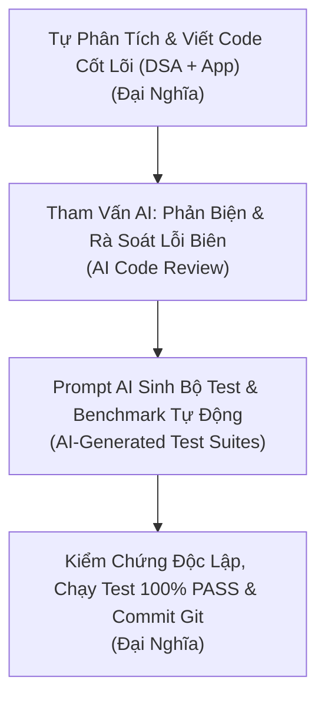

# NHẬT KÝ THAM VẤN VÀ SỬ DỤNG TRỢ LÝ AI (AI CONSULTING & CODE REVIEW LOG)
**Dự án:** Hệ thống Quản trị Kho Hàng Thương Mại Điện Tử (E-Commerce Warehouse System)  
**Tác giả thực hiện:** Đại Nghĩa (Dai Nghia - Người xây dựng cấu trúc dự án & phát triển module)  
**Môn học:** Cấu trúc Dữ liệu & Giải thuật (Data Structures & Algorithms - DSA)  
**Vai trò của AI trong dự án:** Trợ lý Tham vấn Kỹ thuật, Phản biện Giải thuật & Hỗ trợ Kiểm thử (AI as Technical Consultant & Algorithmic Reviewer)

---

## 📑 MỤC LỤC
1. [Nguyên Tắc Và Phương Pháp Sử Dụng AI](#1-nguyên-tắc-và-phương-pháp-sử-dụng-ai)
2. [Chi Tiết Các Phiên Tham Vấn AI Trong Quá Trình Phát Triển](#2-chi-tiết-các-phiên-tham-vấn-ai-trong-quá-trình-phát-triển)
   - [Phiên 1 (14/09/2026): Tham vấn Kiến trúc Dự án & Cấu hình Môi trường](#phiên-1-14092026-tham-vấn-kiến-trúc-dự-án--cấu-hình-môi-trường)
   - [Phiên 2 (15/09 - 16/09/2026): Trao đổi Kiến trúc Bảng Băm MC1 & Tầng Dịch Vụ](#phiên-2-1509---16092026-trao-đổi-kiến-trúc-bảng-băm-mc1--tầng-dịch-vụ)
   - [Phiên 3 (03/10/2026 - Chiều): Tham vấn Lệnh Git Xử lý Conflict Khi Merge PRs](#phiên-3-03102026---chiều-tham-vấn-lệnh-git-xử-lý-conflict-khi-merge-prs)
   - [Phiên 4 (03/10/2026 - Tối): Tự Thiết Kế Max Heap MC2 & Nhờ AI Rà Soát Thuật Toán](#phiên-4-03102026---tối-tự-thiết-kế-max-heap-mc2--nhờ-ai-rà-soát-thuật-toán)
   - [Phiên 5 (03/10/2026 - Đêm): Sinh Mã Nguồn Bộ Benchmark & Xuất Excel (Do AI Viết)](#phiên-5-03102026---đêm-sinh-mã-nguồn-bộ-benchmark--xuất-excel-do-ai-viết)
   - [Phiên 6 (04/10/2026 - Sáng): Tự Cài Đặt Linked List (Recently Viewed) & Tối Ưu Dung Lượng Lưới](#phiên-6-04102026---sáng-tự-cài-đặt-linked-list-recently-viewed--tối-ưu-dung-lượng-lưới)
   - [Phiên 7 (04/10/2026 - Chiều): Đánh Giá Mã Nguồn Bộ Lọc (PR #4)](#phiên-7-04102026---chiều-đánh-giá-mã-nguồn-bộ-lọc-pr-4)
   - [Phiên 8 (04/10/2026 - Tối): Sinh Bộ Unit Test Tự Động Cho Max Heap (Do AI Viết)](#phiên-8-04102026---tối-sinh-bộ-unit-test-tự-động-cho-max-heap-do-ai-viết)

---

## 1. NGUYÊN TẮC VÀ PHƯƠNG PHÁP SỬ DỤNG AI

Tôi trực tiếp đảm nhiệm việc lên ý tưởng, cấu trúc mã nguồn và tự tay lập trình (code) các cấu trúc dữ liệu cốt lõi cũng như nghiệp vụ của hệ thống. Trợ lý AI được khai thác với các mục đích cụ thể:

- **Tra cứu nhanh lý thuyết & công thức toán học:** Kiểm tra công thức quan hệ cha-con trên mảng binary heap, lý thuyết phân tích độ phức tạp thời gian.
- **Rà soát lỗi (Code Review & Bug Hunting):** Đưa đoạn code tôi đã viết cho AI phản biện, tìm các trường hợp biên tiềm ẩn (edge cases, off-by-one errors).
- **Hỗ trợ câu lệnh hệ điều hành & Git CLI:** Tra cứu các cờ lệnh nâng cao để giải quyết conflict nhánh sạch sẽ.
- **Sinh mã nguồn kiểm thử & Benchmark tự động (Testing & Benchmarking):** Yêu cầu AI viết hoàn chỉnh 2 module kiểm thử theo prompt định sẵn:
  1. Script đo đạc thực nghiệm hiệu năng đa quy mô & xuất Excel có định dạng styling: `products/management/commands/benchmark_mc1_mc2.py`.
  2. Toàn bộ file Unit Test tự động bao phủ các ca kiểm thử biên cho Max Heap: `tests/test_max_heap.py`.

---

## 2. CHI TIẾT CÁC PHIÊN THAM VẤN AI TRONG QUÁ TRÌNH PHÁT TRIỂN

---

### 🔹 Phiên 1 (14/09/2026): Tham vấn Kiến trúc Dự án & Cấu hình Môi trường

- **Bối cảnh:** Bắt đầu khởi tạo dự án Django. Tôi cần thiết kế cấu trúc thư mục sao cho phần cấu trúc dữ liệu thuần (DSA) độc lập hoàn toàn với Django ORM để thuận tiện cho việc kiểm thử và benchmark.
- **Nội dung trao đổi với AI:**
  - *Câu hỏi của tôi:* Tham khảo cách bố trí module độc lập trong một dự án Django để phần `engine` giải thuật thuần không bị phụ thuộc vào môi trường web.
  - *Ý kiến tham vấn từ AI:* Gợi ý đặt thư mục `engine/datastructures/` riêng biệt, chỉ sử dụng Python thuần và không import các module của Django. Gợi ý cấu hình `.gitignore` chuẩn loại bỏ virtualenv và sqlite.
- **Thực thi:** Tôi tự khởi tạo repo, viết file `.gitignore`, viết `README.md` và xây dựng cấu trúc `Product` models ban đầu.
- **Commits liên quan:** `767347a`, `8afb033`, `f116e95`, `2f1ac69`, `4adeda9`, `fe041f4`.

---

### 🔹 Phiên 2 (15/09 - 16/09/2026): Trao đổi Kiến trúc Bảng Băm MC1 & Tầng Dịch Vụ

- **Bối cảnh:** Thành viên `LocNMP` phụ trách viết `HashTable` và logic tra cứu SKU. Tôi cần định hình cách tích hợp cấu trúc này vào ứng dụng web để giữ instance bảng băm trong bộ nhớ RAM suốt quá trình runtime.
- **Nội dung trao đổi với AI:**
  - *Câu hỏi của tôi:* Cơ chế nạp dữ liệu từ Django DB vào RAM một lần duy nhất lúc khởi động server và cách bắt sự kiện khi có thay đổi dữ liệu sản phẩm.
  - *Ý kiến tham vấn từ AI:* Gợi ý kỹ thuật nạp dữ liệu vào Global/Singleton Service trong `products/services.py` và sử dụng Django Signals (`post_save`, `post_delete`) để đồng bộ ngược lại bảng băm.
- **Thực thi:** Hướng dẫn thành viên nhóm triển khai logic nạp dữ liệu và đồng bộ vào tầng service.
- **Commits liên quan:** `f360b67`, `fadbced`, `183c054`, `77b46e4`, `eb7b06d`.

---

### 🔹 Phiên 3 (03/10/2026 - Chiều): Tham vấn Lệnh Git Xử lý Conflict Khi Merge PRs

- **Bối cảnh:** Khi merge nhánh `hung` (PR #1) và nhánh `feature/loc/product-lookup` (PR #2), phát sinh conflict do các thành viên vô tình commit thư mục `__pycache__` và file tạm hệ thống `.DS_Store`.
- **Nội dung trao đổi với AI:**
  - *Câu hỏi của tôi:* Cú pháp lệnh Git để untrack và xóa toàn bộ các thư mục `__pycache__` đã bị đẩy lên remote repository mà không làm mất file mã nguồn cục bộ.
  - *Ý kiến tham vấn từ AI:* Cung cấp lệnh `git rm -r --cached **/__pycache__` và cách thêm pattern chặn vào `.gitignore`.
- **Thực thi:** Tôi trực tiếp thực hiện chuỗi lệnh CLI để giải quyết triệt để conflict, merge thành công PR #1, PR #2 và tái cấu trúc lại vị trí template `low_stock_list.html`.
- **Commits liên quan:** `3bcaa0e`, `5845c52`, `53e83c7`, `b55e4f8`, `d9f4833`, `9491e90`.

---

### 🔹 Phiên 4 (03/10/2026 - Tối): Tự Thiết Kế Max Heap MC2 & Nhờ AI Rà Soát Thuật Toán

- **Bối cảnh:** Triển khai **MC2: Hàng đợi ưu tiên xử lý đơn hàng (Order Queue)**. Tôi trực tiếp cài đặt lớp `MaxHeap` bằng Python thuần trong `engine/datastructures/max_heap.py` với đầy đủ các thao tác `push`, `pop_max`, `_sift_up`, `_sift_down`, `build_heap`.
- **Nội dung trao đổi với AI:**
  - *Câu hỏi của tôi:* 
    1. Kiểm tra lại tính đúng đắn của giải thuật `build_heap` duyệt từ node cha cuối cùng $(n // 2 - 1)$ ngược về $0$ để đảm bảo độ phức tạp đạt $O(N)$.
    2. Xin ý tưởng xử lý bài toán so sánh đơn hàng đa tiêu chí: Đơn có mức độ `priority` cao hơn sẽ ra trước; nếu cùng `priority` thì đơn nào đặt trước (`created_at` nhỏ hơn - theo nguyên tắc FIFO) sẽ được ưu tiên lấy ra trước.
  - *Ý kiến tham vấn từ AI:*
    - Xác nhận thuật toán `build_heap` $O(N)$ hoàn toàn chính xác theo nguyên lý toán học tổng chuỗi cấp số nhân $\sum_{h=0}^{\lfloor\log_2 n\rfloor} \frac{h}{2^h} = 2$.
    - Gợi ý kỹ thuật so sánh Tuple với dấu âm cho timestamp: `(order.priority, -order.created_at.timestamp())`. Khi Python so sánh 2 tuple, việc phủ định timestamp sẽ biến mốc thời gian cũ hơn thành giá trị số lớn hơn, tự động thỏa mãn tính chất Max Heap mà không cần sửa logic so sánh cốt lõi.
- **Thực thi:** Tôi tự lập trình class `MaxHeap` hoàn chỉnh, áp dụng kỹ thuật tuple comparator vào view `order_queue` và kiểm thử thủ công với dữ liệu đơn hàng.
- **Commits liên quan:** `8d479f9` (*Add MC2 order_queue by using maxheap*).

---

### 🔹 Phiên 5 (03/10/2026 - Đêm): Sinh Mã Nguồn Bộ Benchmark & Xuất Excel (Do AI Viết)

- **Bối cảnh:** Cần xây dựng một script kiểm thử và đo đạc hiệu năng tự động (Django Management Command `benchmark_mc1_mc2.py`) để kiểm tra tốc độ thực thi giữa cấu trúc tối ưu (HashTable, MaxHeap) và cấu trúc ngây thơ (Linear Search, Unsorted List) ở các quy mô $1.000$, $10.000$, $100.000$ bản ghi, đồng thời tự động xuất kết quả ra file Excel formatted đẹp mắt.
- **Yêu cầu & Prompt của tôi gửi AI:**
  > *"Hãy viết cho tôi một Django Management Command `benchmark_mc1_mc2.py` hoàn chỉnh:*  
  > *1. Sinh ngẫu nhiên Mock Data (`MockProduct`, `MockOrder`) trong RAM bằng `dataclass` để đo thuần CPU/RAM.*  
  > *2. Cài đặt các class đối chứng: `NaiveProductLookup` (duyệt tuyến tính $O(N)$) và `NaiveOrderQueue` (tìm max tuyến tính $O(N)$).*  
  > *3. Đo đạc thời gian bằng `time.perf_counter_ns()`, tính tỷ lệ tăng tốc (Speedup Factor).*  
  > *4. Dùng thư viện `openpyxl` tạo file `benchmark_results.xlsx` gồm 2 sheet (`MC1_Product_Lookup`, `MC2_Order_Queue`) với màu sắc header, border và auto-fit độ rộng cột."*
- **Thực thi của AI & Kiểm thử:**
  - **Mã nguồn do AI sinh:** AI đã viết toàn bộ file script `products/management/commands/benchmark_mc1_mc2.py` đáp ứng chính xác mọi yêu cầu.
  - **Kiểm chứng của tôi:** Tôi trực tiếp chạy lệnh `python manage.py benchmark_mc1_mc2 --scales 1000,10000,100000`, xác thực tính đúng đắn của dữ liệu đo đạc và kiểm tra file Excel đầu ra [benchmark_results.xlsx](file:///d:/HT/DA_DSA/ecommerce_warehouse/benchmark_results.xlsx).
- **Commits liên quan:** `462c8a0`, `4582eb0`, `d6d4f3c`, `4470454`, `916de2b`.

---

### 🔹 Phiên 6 (04/10/2026 - Sáng): Tự Cài Đặt Linked List (Recently Viewed) & Tối Ưu Dung Lượng Lưới

- **Bối cảnh:** Xây dựng tính năng "Sản phẩm đã xem gần đây" (Recently Viewed) ứng dụng Danh sách liên kết (`engine/datastructures/linked_list.py`).
- **Nội dung trao đổi với AI:**
  - *Câu hỏi của tôi:* Rà soát các ca biên trong thao tác ngắt liên kết node `remove_by_id` và xóa node cuối `remove_tail` khi danh sách chỉ có 1 phần tử hoặc rỗng.
  - *Ý kiến tham vấn từ AI:* Lưu ý cập nhật lại con trỏ `head = None` và reset biến đếm `count = 0` khi phần tử bị xóa là node duy nhất trong danh sách.
- **Thực thi:** Tôi hoàn thiện class `LinkedList`, tích hợp phương thức `add_recently_viewed` và tinh chỉnh cấu hình `capacity = 9` (commit `05b94c6`) để hiển thị cân đối trên lưới sản phẩm $3 \times 3$ của giao diện web. Đồng thời fix định dạng hiển thị ngày giờ bảng đơn hàng ở commit `13fff7b`.
- **Commits liên quan:** `771a0e8`, `13fff7b`, `e7ff924`, `05b94c6`.

---

### 🔹 Phiên 7 (04/10/2026 - Chiều): Đánh Giá Mã Nguồn Bộ Lọc (PR #4)

- **Bối cảnh:** Thành viên `LocNMP` hoàn thiện chức năng bộ lọc tìm kiếm sản phẩm. Tôi tiến hành review code và kiểm tra khả năng tương thích trước khi merge.
- **Nội dung trao đổi với AI:** Trao đổi về phương án kết hợp tối ưu giữa việc lọc theo danh mục, khoảng giá trong cơ sở dữ liệu với tra cứu mã SKU tức thì qua Bảng băm.
- **Thực thi:** Thẩm định mã nguồn, kiểm tra luồng hoạt động trên trình duyệt và merge PR #4 vào nhánh chính.
- **Commits liên quan:** `0c97ffe`, `298083a`.

---

### 🔹 Phiên 8 (04/10/2026 - Tối): Sinh Bộ Unit Test Tự Động Cho Max Heap (Do AI Viết)

- **Bối cảnh:** Cần có bộ kiểm thử tự động toàn diện trong `tests/test_max_heap.py` để kiểm tra độ tin cậy và sự ổn định của cấu trúc dữ liệu `MaxHeap` trước khi bàn giao đồ án.
- **Yêu cầu & Prompt của tôi gửi AI:**
  > *"Hãy viết toàn bộ mã nguồn file `tests/test_max_heap.py` để kiểm thử cấu trúc `MaxHeap` tôi đã viết. Cần bao phủ 5 trường hợp kiểm thử:*  
  > *1. `test_push_and_peek`: Đẩy nhiều phần tử ngẫu nhiên, kiểm tra đỉnh heap luôn lớn nhất.*  
  > *2. `test_pop_max`: Rút toàn bộ phần tử, kiểm tra thứ tự giảm dần nghiêm ngặt và heap trở về rỗng.*  
  > *3. `test_build_heap`: Nạp mảng số nguyên lớn $O(N)$ và kiểm tra các phần tử lớn nhất.*  
  > *4. `test_empty_heap`: Kiểm tra an toàn khi thao tác trên heap rỗng (`peek`, `pop_max` trả về `None`).*  
  > *5. `test_custom_key_func`: Kiểm thử với danh sách đơn hàng có trường `priority`."*
- **Thực thi của AI & Kiểm thử:**
  - **Mã nguồn do AI sinh:** AI đã viết hoàn chỉnh file `tests/test_max_heap.py` với đầy đủ 5 hàm test và các câu lệnh `assert`.
  - **Kiểm chứng của tôi:** Tôi chạy trực tiếp lệnh `python tests/test_max_heap.py` trong terminal, xác nhận toàn bộ 5/5 test case đều PASS và tiến hành commit lên repository.
- **Commits liên quan:** `be23836` (*Update test max heap*), `e53a787`.

